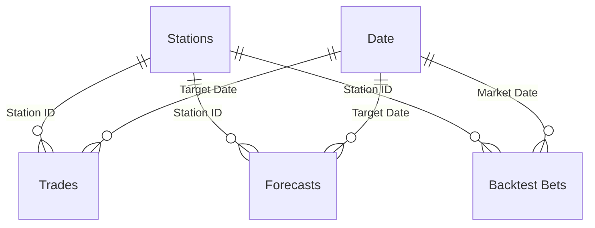

# HighTempBot Power BI report

A Power BI report on the trading bot's data: trade results, weather forecast
accuracy, backtest versus live performance, and data quality checks on the
source database.

The report is saved as a Power BI Project (`.pbip`), so the data model, Power
Query steps, DAX measures and report layout are all plain text and can be
reviewed in this repository.

## Pages

| Page | Question it answers |
|---|---|
| Overview | How did live and paper trading perform, and in which cities? |
| Trade Explorer | What happened on each bet? Filter by mode, side, outcome or city. |
| Forecast Accuracy | How close is each weather model's day-ahead forecast to the observed high? |
| Backtest vs Live | How did the backtest runs compare with live results? |
| Data Quality | Which validation rules fail, and does the bot's ledger match the exchange wallet? |

## Data model

Star schema with two shared dimensions. All relationships are one-to-many with
single-direction filtering.



`Reconciliation` and `Data Quality` are standalone tables. All measures live in
the `Key Measures` table, grouped into display folders. Implicit measures and
auto date/time are turned off.

Column definitions are in [data-dictionary.md](data-dictionary.md).

## How the data is built

```
SQLite database (bot)
  -> sql/*.sql            one query per table (CTEs, window functions, JSON extraction)
  -> export_data.py       runs the queries, writes data/*.csv and data/*.parquet
  -> Power Query (M)      types columns, derives bracket labels and outcome flags,
                          maps model codes to names, combines the backtest files
  -> semantic model       relationships and DAX measures
```

The extracts in `data/` are committed so the report opens without the bot's
database. They contain no wallet addresses, order ids, token ids or
transaction hashes.

Backtest bets are read directly from `../backtest/results/bets/*.parquet` with
a Power Query folder combine.

## Open the report

1. Install Power BI Desktop (August 2026 or later).
2. Open `HighTempBot.pbip`.
3. Go to **Transform data > Edit parameters** and set `ProjectFolder` to the
   folder you cloned this repository into.
4. Select **Refresh**.

## Rebuild the extracts

Requires the bot's SQLite database, which is not in this repository.

```bash
python powerbi/export_data.py --db data/hightempbot_server_latest.db
```

## Data quality rules

`sql/data_quality_checks.sql` defines 12 rules across trades, weather data and
wallet reconciliation. On the 24 May 2026 snapshot, 9 pass and 3 fail:

| Rule | Result | Finding |
|---|---|---|
| WX-01 | 3 rows | Observed highs of 71, 88 and 89 °C, consistent with Fahrenheit values stored as Celsius. Excluded from the forecast error table. |
| WX-02 | 15 rows | One-day spikes of 15 °C or more against both neighbouring days, for example 53.9 °C in a Buenos Aires winter. Flagged for review, not excluded. |
| WX-03 | 2,239 rows | Day-ahead forecasts with no observation to score against. 90% come from gaps in three stations' observation history: Taipei (1,199), Istanbul (538) and Moscow (287). |

Reconciliation compares the ledger with the exchange's wallet API on every
run. Across 301 runs, 42 records did not match (22 wallet trades with no ledger
row, 20 positions that differed). The latest run is fully matched.

## Reading the numbers

- The trading sample is small: 25 settled live bets and 142 paper bets between
  9 and 23 May 2026.
- Backtest bets use fixed stakes of about $7. The out-of-sample champion run
  returns $1,381.56 on 308 bets at that stake. The $2,537 figure in
  `backtest/README.md` is the same period with compounding bankroll sizing.
- Live trading did not reproduce the backtests. The reasons are in
  `backtest/results/research_2026_07/README.md`.
